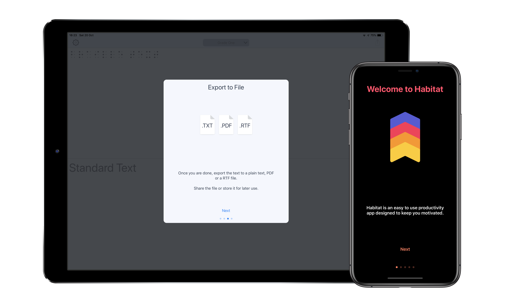

[](https://developer.apple.com/swift/)
[](http://cocoapods.org/pods/OnboardKit)
[](http://cocoapods.org/pods/OnboardKit)
[](https://github.com/Carthage/Carthage)
[](https://twitter.com/NikolaKirev)

# OnboardKit
*Customizable user onboarding for your UIKit app in Swift*

<p align="center"></p>

## Requirements

* Swift 5.0
* Xcode 10
* iOS 11.0+

## Installation

#### [Carthage](https://github.com/Carthage/Carthage)

````bash
github "NikolaKirev/OnboardKit"
````

#### [CocoaPods](http://cocoapods.org)

````ruby
use_frameworks!

# Latest release in CocoaPods
pod 'OnboardKit'

# Get the latest on master
pod 'OnboardKit', :git => 'https://github.com/NikolaKirev/OnboardKit.git', :branch => 'master'
````

Don't forget to `import OnboardKit` in the file you intend to use it.

## Usage

1. Create and populate a bunch of `OnboardPage` instances
````swift
let page = OnboardPage(title: "Welcome to OnboardKit",
                       imageName: "Onboarding1",
                       description: "OnboardKit helps you add onboarding to your iOS app")
````
2. Create an `OnboardViewController`
````swift
let onboardingViewController = OnboardViewController(pageItems: [pageOne, ...]])
````
3. Present the view controller
````swift
onboardingVC.presentFrom(self, animated: true)
````
(use this convenience method to make sure you present it modally)

## Customization



#### Customizing Fonts and Colors
You can customize the look of your onboarding by changing the default colors and fonts.

1. Initialize an `AppearanceConfiguration` instance with the desired custom style properties
````swift
let appearance = AppearanceConfiguration(tintColor: .orange,
                                         titleColor: .red,
                                         textColor: .white,
                                         backgroundColor: .black,
                                         imageContentMode: .scaleAspectFit,
                                         titleFont: UIFont.boldSystemFont(ofSize: 32.0),
                                         textFont: UIFont.boldSystemFont(ofSize: 17.0))
````
2. Pass the `AppearanceConfiguration` instance as a parameter when initialising an `OnboardViewController`
````swift
let onboardingVC = OnboardViewController(pageItems: onboardingPages,
                                         appearanceConfiguration: appearance)
````

##### List of customizable properties:
- `tintColor` - used for tinting the advance and action buttons
- `titleColor` - used to set title color (textColor is used if not specified)
- `textColor` - used to set description text color
- `backgroundColor` - used to set view background color
- `imageContentMode` - used to set the content mode of page imageViews
- `titleFont` - used to set the title font (used for the action button font as well) 
- `textFont` - used to set the description text font (used for the advance button font as well)
- `advanceButtonStyling` - a block used to customize the advance button
- `actionButtonStyling` - a block used to customize the action button

#### Customizing Buttons
To customize the style of the advance and action buttons on each page of the onboarding flow, you can use a `ButtonStyling` closure.

1. Create the closure
````swift
let advanceButtonStyling: OnboardViewController.ButtonStyling = { button in
    button.setTitleColor(UIColor.lightGray, for: .normal)
    button.titleLabel?.font = UIFont.systemFont(ofSize: 16.0, weight: .semibold)
}
````
2. Pass the closure in the `AppearanceConfiguration` initializer
````swift
let appearance = OnboardViewController.AppearanceConfiguration(tintColor: .orange,
                                                               advanceButtonStyling: advanceButtonStyling)
````

## Author

### Nikola Kirev

* Website: [http://nikolakirev.com](http://nikolakirev.com)
* Twitter: [@NikolaKirev](http://twitter.com/nikolakirev)

## License

OnboardKit is available under the MIT license. See the [LICENSE](https://github.com/NikolaKirev/OnboardKit/blob/master/LICENSE) file for more info.
